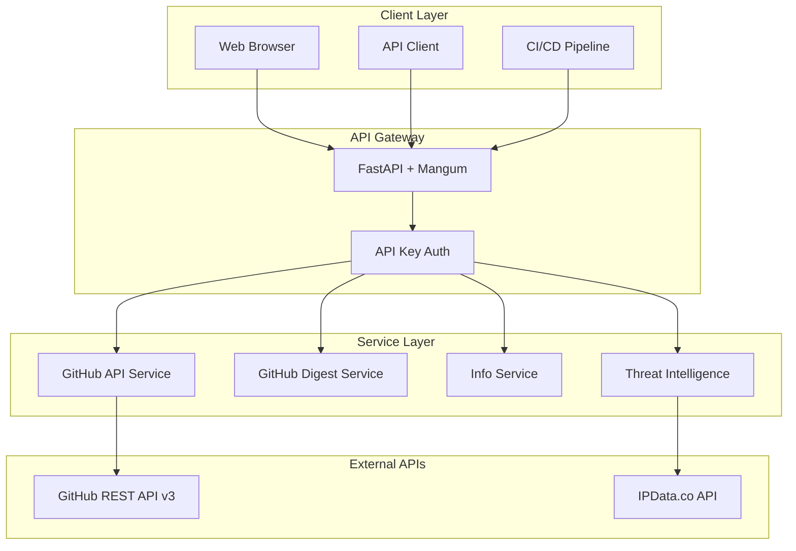

# MGraph-AI Service GitHub Digest

[](https://github.com/the-cyber-boardroom/MGraph-AI__Service__GitHub__Digest/releases)
[](https://www.python.org/downloads/)
[](https://fastapi.tiangolo.com/)
[](https://aws.amazon.com/lambda/)
[](LICENSE)
[](https://github.com/the-cyber-boardroom/MGraph-AI__Service__GitHub__Digest/actions)

A production-ready FastAPI microservice that provides GitHub repository analysis, content digestion, and threat intelligence capabilities. Built for AWS Lambda deployment with a focus on type safety and security.

## 🚀 Features

- **GitHub Repository Analysis**: Fetch repository metadata, commits, issues, and file contents
- **Content Digestion**: Generate markdown digests of repository contents with intelligent filtering
- **Threat Intelligence**: IP address validation and threat analysis via IPData.co integration
- **Type-Safe Architecture**: Comprehensive input validation preventing injection attacks
- **Multi-Stage Deployment**: Automated CI/CD pipeline for dev, QA, and production environments
- **AWS Lambda Ready**: Optimized for serverless deployment with cold start handling

## 📋 Table of Contents

- [Quick Start](#-quick-start)
- [Installation](#-installation)
- [API Documentation](#-api-documentation)
- [Architecture](#-architecture)
- [Configuration](#-configuration)
- [Development](#-development)
- [Testing](#-testing)
- [Deployment](#-deployment)
- [Security](#-security)
- [Contributing](#-contributing)
- [License](#-license)

## 🎯 Quick Start

### Local Development

```bash
# Clone the repository
git clone https://github.com/the-cyber-boardroom/MGraph-AI__Service__GitHub__Digest.git
cd MGraph-AI__Service__GitHub__Digest

# Install dependencies
pip install -r requirements-test.txt
pip install -e .

# Set environment variables
export FAST_API__AUTH__API_KEY__NAME="x-api-key"
export FAST_API__AUTH__API_KEY__VALUE="your-secret-key"
export IP_DATA__API_KEY="your-ipdata-api-key"  # Optional

# Run locally
./run-locally.sh
# or
uvicorn mgraph_ai_service_github_digest.fast_api.lambda_handler:app --reload --host 0.0.0.0 --port 10010
```

### Basic Usage

```python
import requests

# Set up authentication
headers = {"x-api-key": "your-secret-key"}
base_url = "http://localhost:10010"

# Get repository information
response = requests.get(
    f"{base_url}/github-api/repository",
    params={"owner": "owasp-sbot", "repo": "OSBot-Utils"},
    headers=headers
)
print(response.json())

# Generate a markdown digest of Python files
response = requests.get(
    f"{base_url}/github-digest/repo-files-in-markdown",
    params={
        "owner": "owasp-sbot",
        "repo": "OSBot-Utils",
        "filter_starts_with": "osbot_utils",
        "filter_ends_with": ".py"
    },
    headers=headers
)
print(response.text)
```

## 📦 Installation

### Prerequisites

- Python 3.12+
- AWS CLI (for deployment)
- Docker (for LocalStack testing)

### Using Poetry

```bash
# Install poetry if not already installed
pip install poetry

# Install dependencies
poetry install

# Activate virtual environment
poetry shell
```

### Using pip

```bash
# Create virtual environment
python -m venv venv
source venv/bin/activate  # On Windows: venv\Scripts\activate

# Install dependencies
pip install -r requirements-test.txt
pip install -e .
```

## 📖 API Documentation

### Interactive API Documentation

Once the service is running, access the interactive API documentation at:
- Swagger UI: http://localhost:10010/docs
- ReDoc: http://localhost:10010/redoc

### Endpoints Overview

#### GitHub API Endpoints

| Endpoint | Method | Description |
|----------|--------|-------------|
| `/github-api/apis-available` | GET | List available GitHub API endpoints |
| `/github-api/rate-limit` | GET | Check GitHub API rate limit status |
| `/github-api/repository` | GET | Get repository metadata |
| `/github-api/repository-commits` | GET | List repository commits |
| `/github-api/repository-issues` | GET | List repository issues |
| `/github-api/repository-files-names` | GET | List all file paths in repository |
| `/github-api/repository-text-files` | GET | Get filtered text file contents |

#### GitHub Digest Endpoints

| Endpoint | Method | Description |
|----------|--------|-------------|
| `/github-digest/repo-files-in-markdown` | GET | Generate markdown digest of repository files |

#### Information Endpoints

| Endpoint | Method | Description |
|----------|--------|-------------|
| `/info/version` | GET | Get service version |
| `/info/ip-address` | GET | Get current IP address |
| `/info/ip-address-multiple-sources` | GET | Get IP from multiple sources |

#### Threat Intelligence Endpoints

| Endpoint | Method | Description |
|----------|--------|-------------|
| `/threat-intelligence/ip-address-details` | GET | Get detailed IP address information |

### Example Requests

#### Get Repository Files with Filtering

```bash
curl -X GET "http://localhost:10010/github-api/repository-text-files?\
owner=owasp-sbot&\
repo=OSBot-Utils&\
ref=main&\
filter_starts_with=osbot_utils/helpers&\
filter_ends_with=.py" \
-H "x-api-key: your-secret-key"
```

#### Generate Markdown Digest

```bash
curl -X GET "http://localhost:10010/github-digest/repo-files-in-markdown?\
owner=your-org&\
repo=your-repo&\
filter_starts_with=src/&\
filter_contains=test&\
filter_ends_with=.py" \
-H "x-api-key: your-secret-key" \
-H "Accept: text/markdown" \
-o digest.md
```

## 🏗️ Architecture

### System Overview



### Key Components

- **FastAPI Routes**: RESTful API endpoints with automatic OpenAPI documentation
- **Type-Safe Services**: Core business logic with comprehensive input validation
- **AWS Lambda Handler**: Serverless deployment with optimized cold starts
- **Security Layer**: API key authentication and injection prevention

### Type Safety Architecture

All inputs are validated using custom type-safe primitives:

```python
# Safe repository identifier
repo = Safe_Id("OSBot-Utils")  # ✓ Valid
repo = Safe_Id("../../etc")     # ✗ ValueError: Invalid identifier

# Safe file paths
path = Safe_Str__File__Path("src/main.py")  # ✓ Valid
path = Safe_Str__File__Path("../../../etc/passwd")  # ✗ ValueError: Path traversal

# Safe IP addresses
ip = Safe_Str__IP_Address("192.168.1.1")  # ✓ Valid
ip = Safe_Str__IP_Address("192.168.1.1; rm -rf /")  # ✗ ValueError: Invalid IP
```

## ⚙️ Configuration

### Environment Variables

| Variable | Description | Required | Default |
|----------|-------------|----------|---------|
| `FAST_API__AUTH__API_KEY__NAME` | Header name for API key | Yes | - |
| `FAST_API__AUTH__API_KEY__VALUE` | API key value | Yes | - |
| `IP_DATA__API_KEY` | IPData.co API key | No | - |
| `AWS_REGION` | AWS region (triggers Lambda mode) | No | - |
| `DEBUG` | Enable debug logging | No | false |

### Configuration File

Create a `.env` file for local development:

```env
FAST_API__AUTH__API_KEY__NAME=x-api-key
FAST_API__AUTH__API_KEY__VALUE=development-key-12345
IP_DATA__API_KEY=your-ipdata-key
```

## 🛠️ Development

### Project Structure

```
mgraph_ai_service_github_digest/
├── fast_api/
│   ├── lambda_handler.py      # AWS Lambda entry point
│   ├── Service__Fast_API.py   # FastAPI application setup
│   └── routes/               # API endpoint definitions
├── service/
│   ├── github/              # GitHub integration services
│   ├── info/               # System information services
│   └── threat_intelligence/ # IP analysis services
├── utils/
│   ├── deploy/             # Deployment utilities
│   └── for_osbot_utils/    # Custom type safety classes
└── config.py               # Service configuration
```

### Adding New Endpoints

1. Create a new route class:

```python
from osbot_fast_api.api.Fast_API_Routes import Fast_API_Routes

class Routes__MyFeature(Fast_API_Routes):
    tag = 'my-feature'
    
    def my_endpoint(self, param: str = "default"):
        # Implementation
        return {"result": param}
    
    def setup_routes(self):
        self.add_route_get(self.my_endpoint)
```

2. Register in `Service__Fast_API`:

```python
def setup_routes(self):
    # ... existing routes
    self.add_routes(Routes__MyFeature)
```

### Code Style

The project follows consistent formatting:
- 4 spaces for indentation
- Type annotations for all parameters
- Comprehensive docstrings
- Security-first input validation

## 🧪 Testing

### Running Tests

```bash
# Run all tests
pytest

# Run with coverage
pytest --cov=mgraph_ai_service_github_digest

# Run specific test file
pytest tests/unit/service/github/test_GitHub__API.py

# Run integration tests (requires LocalStack)
pytest tests/integration/
```

### Test Structure

```
tests/
├── unit/                    # Unit tests for individual components
│   ├── service/            # Service layer tests
│   └── fast_api/           # API endpoint tests
├── integration/            # Integration tests with external services
└── deploy_aws/            # Deployment tests
```

### Writing Tests

```python
from unittest import TestCase
from mgraph_ai_service_github_digest.service.github.GitHub__API import GitHub__API

class test_GitHub__API(TestCase):
    @classmethod
    def setUpClass(cls):
        cls.github_api = GitHub__API()
    
    def test_repository(self):
        result = self.github_api.repository(
            owner=Safe_Id("owasp-sbot"),
            repo=Safe_Id("OSBot-Utils")
        )
        assert result['content']['name'] == "OSBot-Utils"
```

## 🚀 Deployment

### AWS Lambda Deployment

The service includes automated deployment scripts for multiple environments:

```bash
# Deploy to development
pytest tests/deploy_aws/test_Deploy__Service__to__dev.py

# Deploy to QA
pytest tests/deploy_aws/test_Deploy__Service__to__qa.py

# Deploy to production (manual trigger)
# Use GitHub Actions workflow
```

### CI/CD Pipeline

The project uses GitHub Actions for continuous deployment:

1. **Development Branch** (`dev`)
   - Runs tests with LocalStack
   - Deploys to dev environment
   - Increments minor version

2. **Main Branch** (`main`)
   - Runs comprehensive test suite
   - Deploys to QA environment
   - Increments major version

3. **Production** (manual)
   - Requires manual workflow trigger
   - Deploys to production environment

### Lambda Configuration

```yaml
Runtime: python3.12
Handler: mgraph_ai_service_github_digest.fast_api.lambda_handler.run
MemorySize: 512
Timeout: 30
Environment:
  Variables:
    FAST_API__AUTH__API_KEY__NAME: "x-api-key"
    FAST_API__AUTH__API_KEY__VALUE: "${ssm:/api-key/value}"
```

## 🔒 Security

### Input Validation

All user inputs are validated using type-safe primitives:
- `Safe_Id`: Alphanumeric + dash only
- `Safe_Str__File__Path`: Only valid paths
- `Safe_Str__IP_Address`: Valid IPv4/IPv6 only

### Authentication

API key authentication is required for all endpoints:

```python
headers = {"x-api-key": "your-secret-key"}
```

### Best Practices

1. **Never commit secrets** - Use environment variables
2. **Validate all inputs** - Use type-safe classes
3. **Monitor rate limits** - Check GitHub API limits
4. **Use HTTPS** - Always encrypt in transit
5. **Rotate API keys** - Regular key rotation

## 🤝 Contributing

We welcome contributions! Please follow these steps:

1. Fork the repository
2. Create a feature branch (`git checkout -b feature/amazing-feature`)
3. Commit your changes (`git commit -m 'Add amazing feature'`)
4. Push to the branch (`git push origin feature/amazing-feature`)
5. Open a Pull Request

### Development Guidelines

- Write tests for new features
- Update documentation
- Follow existing code style
- Add type annotations
- Consider security implications

## 📚 Documentation

### Core Documentation
- [Technical Overview](docs/index.md) - Complete system documentation
- [Type Safety Patterns](docs/type_safe/mgraph-service-type-safety-patterns.md) - Type safety architecture and patterns

### Component Documentation
- **Infrastructure**
  - [Lambda Handler](docs/code/mgraph_ai_service_github_digest/fast_api/lambda_handler.py.md) - AWS Lambda integration
  - [Deploy Service](docs/code/mgraph_ai_service_github_digest/utils/deploy/Deploy__Service--tech_debrief.md) - Deployment orchestration

- **Services**
  - [GitHub API Service](docs/code/mgraph_ai_service_github_digest/service/github/GitHub__API.py.md) - GitHub API integration
  - [GitHub Digest Service](docs/code/mgraph_ai_service_github_digest/service/github/GitHub__Digest.py.md) - Content aggregation

- **Routes**
  - [GitHub API Routes](docs/code/mgraph_ai_service_github_digest/fast_api/routes/Routes__GitHub.py.md) - RESTful endpoints

- **Security**
  - [IP Address Validation](docs/code/mgraph_ai_service_github_digest/utils/for_osbot_utils/Safe_Str__IP_Address.py.md) - Safe IP handling

## 🔗 Related Projects

- [OSBot-Utils](https://github.com/owasp-sbot/OSBot-Utils) - Core utilities library
- [OSBot-AWS](https://github.com/owasp-sbot/OSBot-AWS) - AWS integration layer
- [OSBot-Fast-API](https://github.com/owasp-sbot/OSBot-Fast-API) - FastAPI utilities
- [OSBot-Fast-API-Serverless](https://github.com/owasp-sbot/OSBot-Fast-API-Serverless) - Serverless framework

## 📄 License

This project is licensed under the Apache License 2.0 - see the [LICENSE](LICENSE) file for details.

## 🙏 Acknowledgments

- Built with [FastAPI](https://fastapi.tiangolo.com/)
- Deployed on [AWS Lambda](https://aws.amazon.com/lambda/)
- Type safety powered by [OSBot-Utils](https://github.com/owasp-sbot/OSBot-Utils)

## 📞 Support

- 🐛 Issues: [GitHub Issues](https://github.com/the-cyber-boardroom/MGraph-AI__Service__GitHub__Digest/issues)
- 💬 Discussions: [GitHub Discussions](https://github.com/the-cyber-boardroom/MGraph-AI__Service__GitHub__Digest/discussions)

---

Created and maintained by [The Cyber Boardroom](https://github.com/the-cyber-boardroom) team