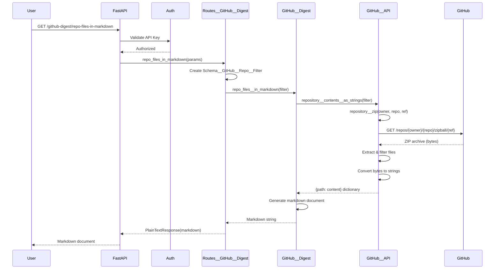
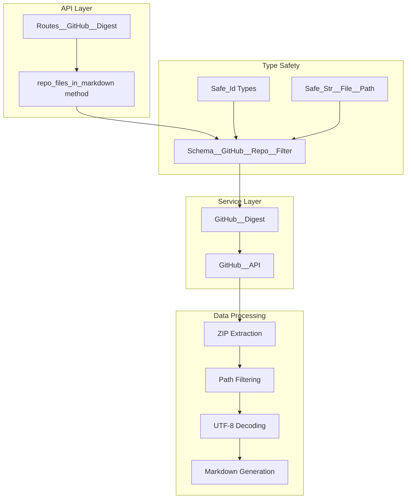
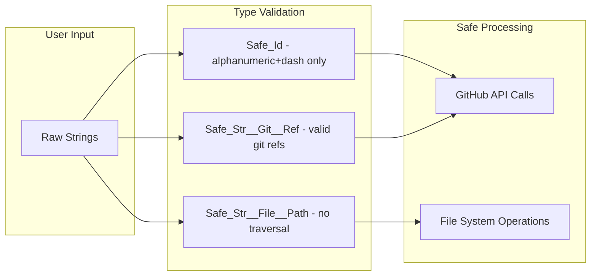
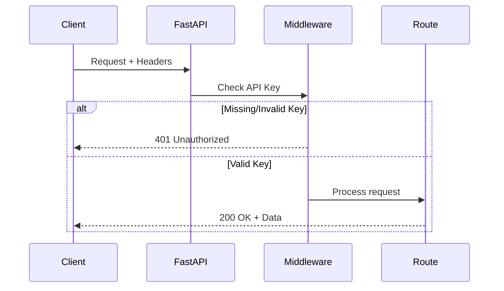
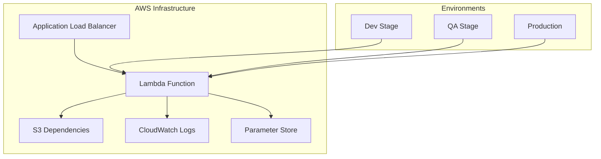

# GitHub Repository Digest Feature - Architecture Documentation

## Executive Summary

The GitHub Repository Digest feature is a production-ready microservice endpoint that transforms GitHub repositories into structured markdown documents. It enables users to fetch, filter, and aggregate repository contents in a single, readable format - ideal for code reviews, AI analysis, documentation generation, and repository archival.

## Core Functionality

### Endpoint Overview

**URL**: `/github-digest/repo-files-in-markdown`  
**Method**: `GET`  
**Authentication**: Required (API Key)

### Query Parameters

| Parameter | Type | Required | Default | Description |
|-----------|------|----------|---------|-------------|
| `owner` | string | No | `owasp-sbot` | Repository owner/organization |
| `name` | string | No | `OSBot-Utils` | Repository name |
| `ref` | string | No | `main` | Branch, tag, or commit SHA |
| `filter_starts_with` | string | No | `""` | Filter files by path prefix |
| `filter_contains` | string | No | `""` | Filter files containing string in path |
| `filter_ends_with` | string | No | `""` | Filter files by suffix (e.g., `.py`) |

### Example Request

```bash
curl -X GET "https://github-digest.dev.mgraph.ai/github-digest/repo-files-in-markdown?\
owner=the-cyber-boardroom&\
name=MGraph-AI__Service__GitHub__Digest&\
ref=dev&\
filter_ends_with=.py" \
-H "x-api-key: your-api-key"
```

## System Architecture

### High-Level Flow



### Component Architecture



## Implementation Details

### 1. Request Processing Pipeline

#### Route Handler (`Routes__GitHub__Digest`)
```python
def repo_files_in_markdown(self, owner, name, ref, 
                          filter_starts_with, filter_contains, filter_ends_with):
    # Creates type-safe filter schema
    repo_filter = Schema__GitHub__Repo__Filter(
        owner=owner, name=name, ref=ref,
        filter_starts_with=filter_starts_with,
        filter_contains=filter_contains,
        filter_ends_with=filter_ends_with
    )
    # Delegates to service layer
    markdown = self.github_digest.repo_files__in_markdown(repo_filter)
    # Returns as markdown MIME type
    return PlainTextResponse(markdown, media_type="text/markdown")
```

### 2. Content Retrieval Strategy

The service uses GitHub's ZIP archive endpoint rather than individual file APIs for efficiency:

**Advantages:**
- Single API call vs. hundreds of individual requests
- Avoids rate limiting issues
- Faster overall retrieval
- Atomic snapshot of repository state

**Process:**
1. Downloads entire repository as ZIP archive
2. Extracts files in memory (no disk I/O)
3. Applies path filters
4. Converts binary content to strings
5. Skips non-text files (via UTF-8 decode error handling)

### 3. Filtering System

Three-level filtering with AND logic:
- **starts_with**: Match path prefix (e.g., `src/`)
- **contains**: Match substring in path (e.g., `test`)
- **ends_with**: Match suffix (e.g., `.py`)

All conditions must pass for inclusion.

### 4. Markdown Generation

The output follows a structured format:

```markdown
# Files from Repo
 
 - owner: {owner}
 - name: {repo} 
 - ref: {ref}

created at: {timestamp}

## Filtered by:
 - starts_with: {filter_starts_with}
 - contains   : {filter_contains}
 - ends_with  : {filter_ends_with}
 
## Files:

Showing {count} files that matched the filter(s) 

### {file_path_1}

{file_contents_1}
---

### {file_path_2}

{file_contents_2}
---
```

## Security Architecture

### Type Safety System

The service implements comprehensive type safety to prevent injection attacks:



**Security Features:**
- Input validation prevents path traversal attacks
- Type-safe primitives block injection attempts
- API key authentication required for all requests
- No execution of downloaded content
- UTF-8 validation prevents binary injection

### Authentication Flow



## Performance Characteristics

### Time Complexity
- **Repository download**: O(1) API calls
- **File extraction**: O(n) where n = number of files
- **Filtering**: O(n) linear scan
- **Markdown generation**: O(m) where m = matched files

### Space Complexity
- Peak memory: ~3x repository text size
  - ZIP archive in memory
  - Extracted files dictionary
  - Generated markdown string

### Optimization Opportunities
1. **Streaming**: Process ZIP without full download
2. **Caching**: Store processed results with TTL
3. **Pagination**: For very large repositories
4. **Parallel processing**: Multi-threaded extraction

## Use Cases

### 1. Code Review & Analysis
- Generate comprehensive code snapshots for review
- Create digestible formats for AI analysis
- Export specific modules or components

### 2. Documentation Generation
- Extract and aggregate documentation files
- Create project overviews
- Generate API documentation bundles

### 3. Compliance & Auditing
- Archive repository states
- Track code evolution
- Security audits of specific file types

### 4. AI/LLM Processing
- Prepare repositories for LLM context windows
- Filter relevant code for specific queries
- Create training datasets from codebases

## Deployment Architecture

### AWS Lambda Deployment



**Deployment Stages:**
- **Dev**: `github-digest.dev.mgraph.ai`
- **QA**: `github-digest.qa.mgraph.ai`
- **Production**: `github-digest.mgraph.ai`

### Performance Metrics

| Metric | Cold Start | Warm Start |
|--------|------------|------------|
| Lambda Init | 2-3s | 0ms |
| Small Repo (<10MB) | 1-2s | 1-2s |
| Medium Repo (10-50MB) | 3-5s | 3-5s |
| Large Repo (50-100MB) | 8-12s | 8-12s |
| Memory Usage | 256-512MB | 256-512MB |

## Best Practices

### 1. Optimal Filtering
```python
# Good: Specific filters reduce output size
params = {
    "filter_starts_with": "src/",
    "filter_ends_with": ".py"
}

# Bad: No filters may generate huge documents
params = {}
```

### 2. Rate Limit Management
- Monitor GitHub API rate limits
- Use authenticated requests for higher limits
- Implement caching for frequently accessed repos

### 3. Error Handling
```python
try:
    response = requests.get(endpoint, params=params)
    response.raise_for_status()
except requests.exceptions.RequestException as e:
    # Handle network errors, rate limits, etc.
    logger.error(f"Failed to fetch digest: {e}")
```

## Limitations & Considerations

### Current Limitations
1. **Size Limits**: Entire repository must fit in memory
2. **Binary Files**: Automatically excluded (cannot decode to UTF-8)
3. **Rate Limiting**: Subject to GitHub API limits (60/hour unauthenticated)
4. **Timeout**: Lambda has 30-second timeout

### Future Enhancements
1. **Streaming Support**: Process large repos without full memory load
2. **Incremental Updates**: Fetch only changed files since last digest
3. **Format Options**: Support JSON, CSV, or custom output formats
4. **Webhook Integration**: Automatic digests on repository events
5. **Diff Generation**: Compare digests across branches/commits

## Conclusion

The GitHub Repository Digest feature provides a robust, secure, and efficient way to transform GitHub repositories into structured markdown documents. Its type-safe architecture, comprehensive filtering capabilities, and production-ready deployment make it an ideal solution for code analysis, documentation, and AI processing workflows.

The service's key strengths include:
- **Security-first design** with injection prevention
- **Efficient batch processing** via ZIP archives
- **Flexible filtering** for targeted content extraction
- **Production-ready** with multi-stage deployment
- **Scalable architecture** on AWS Lambda

This makes it particularly valuable for teams needing to analyze, document, or process repository contents at scale.