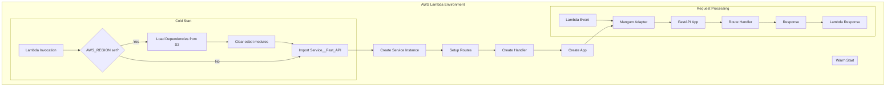
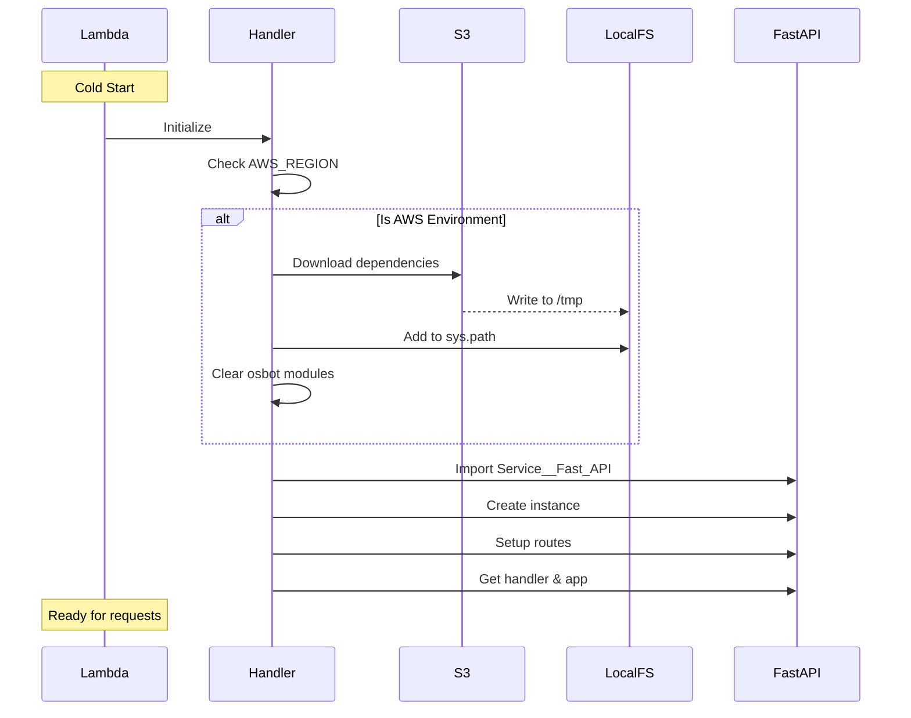
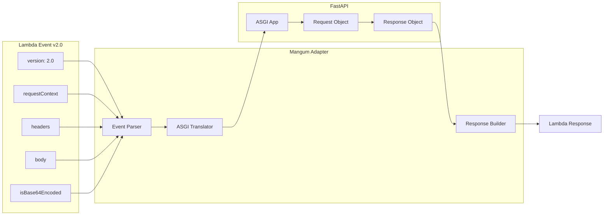

# Lambda Handler Technical Debrief

## Overview

The Lambda handler serves as the **AWS Lambda entry point** for the FastAPI application. It manages dependency loading, cold starts optimization, and request translation between AWS Lambda and ASGI.

**Status**: Production Ready  
**Runtime**: Python 3.12  
**Handler**: `mgraph_ai_service_github_digest.fast_api.lambda_handler.run`

## Architecture



## Module Structure

```python
# Conditional dependency loading
import os

if os.getenv('AWS_REGION'):  # Only in Lambda environment
    from osbot_aws.aws.lambda_.boto3__lambda import load_dependencies
    LAMBDA_DEPENDENCIES = ['osbot-fast-api-serverless']
    
    load_dependencies(LAMBDA_DEPENDENCIES)
    
    def clear_osbot_modules():
        import sys
        for module in list(sys.modules):
            if module.startswith('osbot_aws'):
                del sys.modules[module]
    
    clear_osbot_modules()

# Main imports
from mgraph_ai_service_github_digest.fast_api.Service__Fast_API import Service__Fast_API

# Global instances (reused across warm invocations)
with Service__Fast_API() as _:
    _.setup()
    handler = _.handler()
    app = _.app()

# Lambda entry point
def run(event, context=None):
    return handler(event, context)
```

## Cold Start Optimization



### Dependency Loading Strategy

1. **S3 Storage**: Dependencies pre-packaged and stored in S3
2. **Lazy Loading**: Only loaded when `AWS_REGION` is set
3. **Module Cleanup**: Removes bootstrap modules to save memory
4. **Path Management**: Dependencies added to Python path

### Performance Metrics

| Metric | Cold Start | Warm Start |
|--------|------------|------------|
| Dependency Load | 1-2s | 0ms |
| FastAPI Setup | 200-300ms | 0ms |
| Total Init | 2-3s | 0ms |
| Request Processing | 50-200ms | 50-200ms |
| Memory Usage | 256-512MB | 150-300MB |

## Request Translation

### AWS Lambda Event to ASGI



### Event Format Examples

#### GET Request
```python
{
    "version": "2.0",
    "requestContext": {
        "http": {
            "method": "GET",
            "path": "/info/version",
            "sourceIp": "127.0.0.1"
        }
    },
    "headers": {
        "api-key-name": "api-key-value"
    },
    "rawPath": "/info/version",
    "rawQueryString": ""
}
```

#### POST Request with Body
```python
{
    "version": "2.0",
    "requestContext": {
        "http": {
            "method": "POST",
            "path": "/api/process"
        }
    },
    "headers": {
        "content-type": "application/json"
    },
    "body": '{"key": "value"}',
    "isBase64Encoded": false
}
```

## Service Initialization

### Service__Fast_API Setup

```python
with Service__Fast_API() as _:
    _.setup()      # Initialize routes and middleware
    handler = _.handler()  # Get Mangum handler
    app = _.app()         # Get FastAPI app instance
```

### Route Registration Flow

```mermaid
flowchart LR
    A[Service__Fast_API] --> B[setup()]
    B --> C[setup_routes()]
    
    C --> D[add_routes(Routes__Info)]
    C --> E[add_routes(Routes__GitHub__Digest)]
    C --> F[add_routes(Routes__GitHub__API)]
    C --> G[add_routes(Routes__Threat_Intelligence)]
    
    D --> H[Routes Registered]
    E --> H
    F --> H
    G --> H
```

## Error Handling

### Lambda-Specific Errors

```python
def run(event, context=None):
    try:
        return handler(event, context)
    except RuntimeError as e:
        if "unable to infer a handler" in str(e):
            return {
                "statusCode": 400,
                "body": json.dumps({
                    "error": "Invalid Lambda event format"
                })
            }
        raise
    except Exception as e:
        logger.error(f"Unhandled error: {e}")
        return {
            "statusCode": 500,
            "body": json.dumps({
                "error": "Internal server error"
            })
        }
```

### Common Error Scenarios

1. **Invalid Event Format**
   - Missing required fields
   - Wrong event version
   - Malformed JSON

2. **Dependency Loading Failures**
   - S3 access denied
   - Corrupted dependency packages
   - Insufficient disk space in /tmp

3. **Memory Exhaustion**
   - Large request/response bodies
   - Memory leaks in warm containers

## Configuration Management

### Environment Variables

```python
# Required in Lambda
AWS_REGION = os.getenv('AWS_REGION')
AWS_LAMBDA_FUNCTION_NAME = os.getenv('AWS_LAMBDA_FUNCTION_NAME')

# Application config
FAST_API__AUTH__API_KEY__NAME = os.getenv('FAST_API__AUTH__API_KEY__NAME')
FAST_API__AUTH__API_KEY__VALUE = os.getenv('FAST_API__AUTH__API_KEY__VALUE')
IP_DATA__API_KEY = os.getenv('IP_DATA__API_KEY')
```

### Lambda Configuration

```yaml
Runtime: python3.12
Handler: mgraph_ai_service_github_digest.fast_api.lambda_handler.run
MemorySize: 512
Timeout: 30
Environment:
  Variables:
    FAST_API__AUTH__API_KEY__NAME: "x-api-key"
    FAST_API__AUTH__API_KEY__VALUE: "${ssm:/api-key/value}"
    IP_DATA__API_KEY: "${ssm:/ipdata/api-key}"
```

## Testing Strategies

### Unit Tests

```python
class TestLambdaHandler(TestCase):
    def test_handler_initialization(self):
        from mgraph_ai_service_github_digest.fast_api.lambda_handler import (
            handler, app
        )
        assert handler is not None
        assert app is not None
    
    def test_run_with_valid_event(self):
        event = {
            "version": "2.0",
            "requestContext": {
                "http": {
                    "method": "GET",
                    "path": "/info/version"
                }
            }
        }
        response = run(event)
        assert response["statusCode"] == 200
```

### Integration Tests

```python
def test_lambda_cold_start():
    # Simulate cold start
    if '_service_instance' in globals():
        del globals()['_service_instance']
    
    start_time = time.time()
    response = run(test_event)
    cold_start_time = time.time() - start_time
    
    assert cold_start_time < 3.0  # Should initialize in under 3s
    assert response["statusCode"] == 200
```

### Local Lambda Testing

```python
# Using LocalStack
def test_with_localstack():
    lambda_client = boto3.client(
        'lambda',
        endpoint_url='http://localhost:4566'
    )
    
    response = lambda_client.invoke(
        FunctionName='mgraph-ai-service',
        Payload=json.dumps(test_event)
    )
    
    result = json.loads(response['Payload'].read())
    assert result['statusCode'] == 200
```

## Monitoring and Logging

### CloudWatch Integration

```python
import logging

logger = logging.getLogger()
logger.setLevel(logging.INFO)

def run(event, context=None):
    # Log request details
    logger.info(f"Request ID: {context.request_id if context else 'local'}")
    logger.info(f"Event: {json.dumps(event)}")
    
    try:
        response = handler(event, context)
        logger.info(f"Response status: {response.get('statusCode')}")
        return response
    except Exception as e:
        logger.error(f"Error processing request: {e}", exc_info=True)
        raise
```

### Metrics Collection

```python
import time
from datetime import datetime

def run(event, context=None):
    start_time = time.time()
    
    try:
        response = handler(event, context)
        
        # Log performance metrics
        duration = time.time() - start_time
        logger.info(json.dumps({
            "metric": "request_duration",
            "value": duration,
            "unit": "seconds",
            "timestamp": datetime.utcnow().isoformat()
        }))
        
        return response
    finally:
        # Log memory usage
        if context:
            logger.info(json.dumps({
                "metric": "memory_used",
                "value": context.memory_limit_in_mb,
                "unit": "MB"
            }))
```


## Troubleshooting

### Common Issues

1. **Module Import Errors**
   - Check dependency packaging
   - Verify Lambda layers
   - Check Python version compatibility

2. **Memory Errors**
   - Increase Lambda memory
   - Add response streaming
   - Implement pagination

3. **Timeout Issues**
   - Increase timeout setting
   - Optimize slow operations
   - Implement async processing

### Debug Mode

```python
DEBUG = os.getenv('DEBUG', 'false').lower() == 'true'

def run(event, context=None):
    if DEBUG:
        logger.setLevel(logging.DEBUG)
        logger.debug(f"Raw event: {event}")
        logger.debug(f"Context: {context}")
        
        # Add debug headers to response
        response = handler(event, context)
        response.setdefault('headers', {})['X-Debug-Mode'] = 'true'
        return response
    
    return handler(event, context)
```