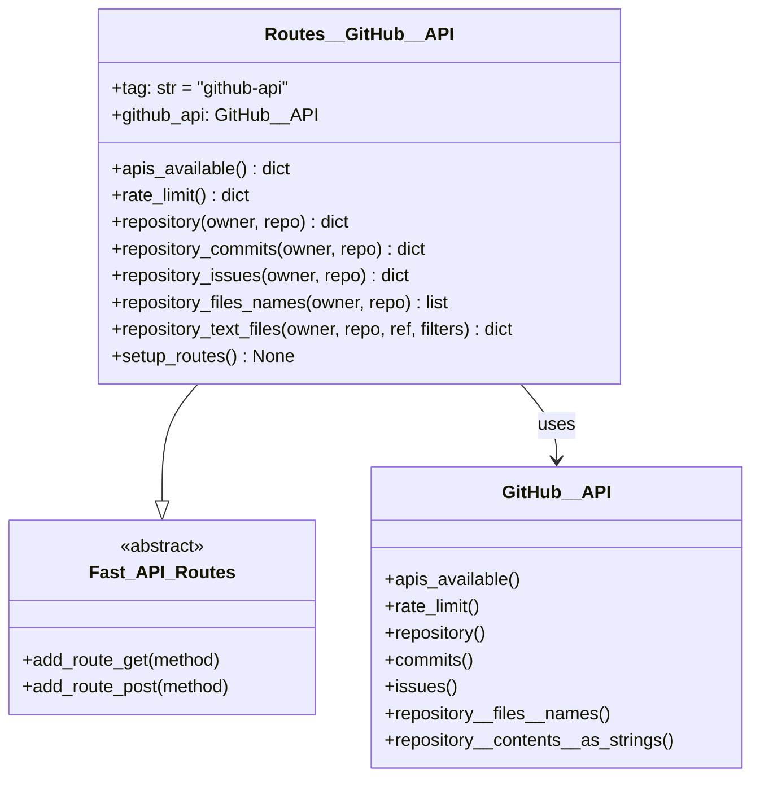
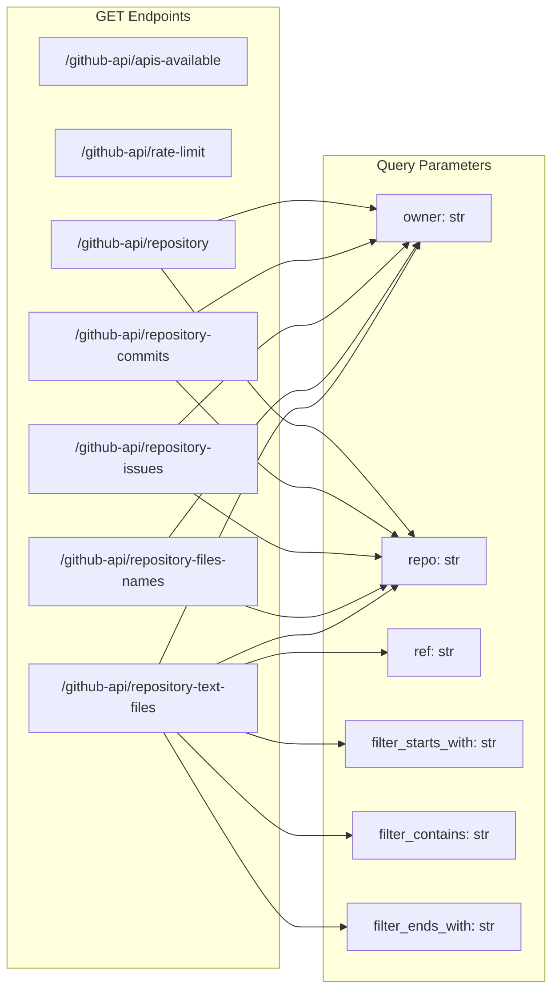
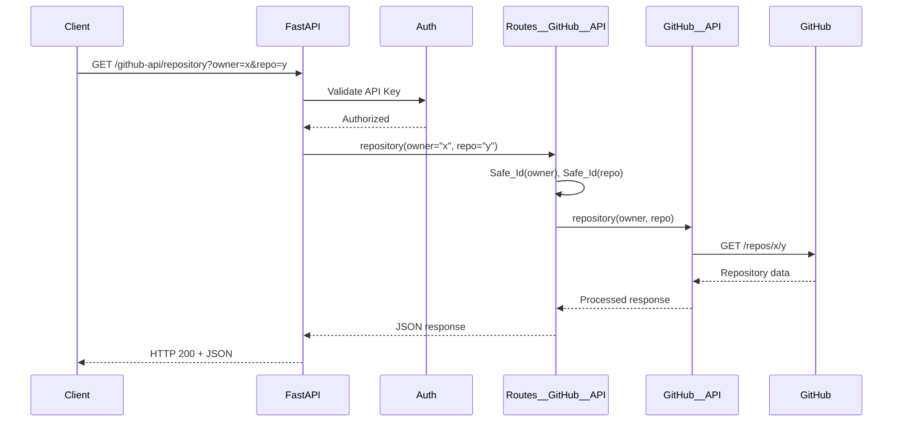
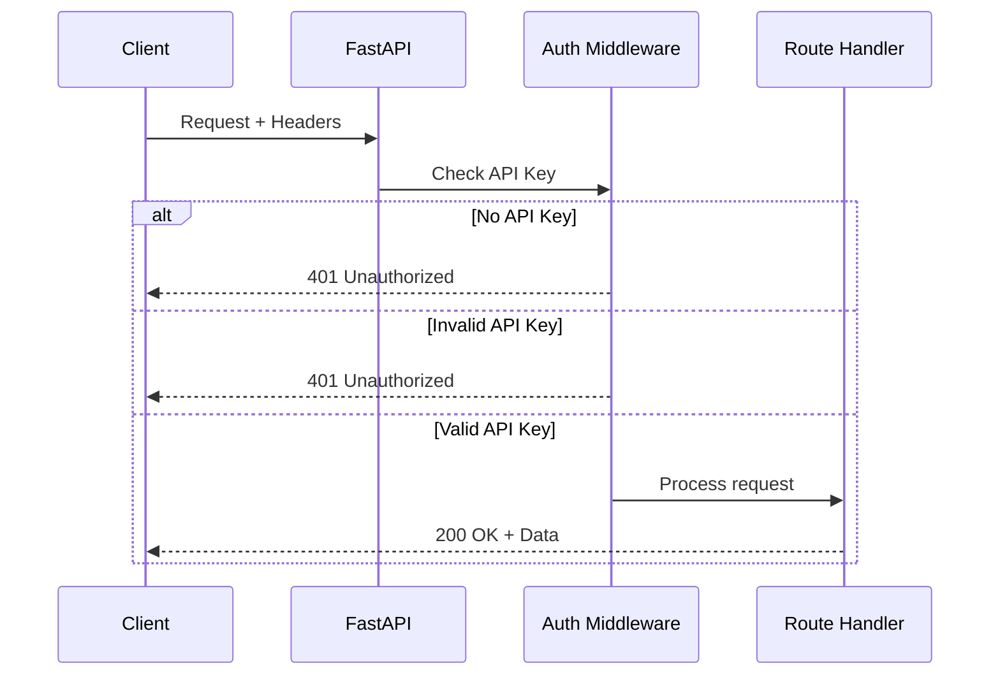

# Routes__GitHub__API Technical Debrief

## Overview

`Routes__GitHub__API` exposes **RESTful endpoints** for GitHub repository operations through FastAPI. It provides a clean HTTP interface to the GitHub__API service with built-in validation and security.

**Status**: Production Ready  
**Base Path**: `/github-api`  
**Authentication**: Required (API Key)

## Architecture



## Endpoint Definitions



## Request Flow



## Endpoint Details

### 1. APIs Available
```python
@router.get("/apis-available")
def apis_available(self):
    return self.github_api.apis_available()
```

**Purpose**: List all available GitHub API endpoints  
**Parameters**: None  
**Response**: Dictionary of API endpoints with their URLs

### 2. Rate Limit
```python
@router.get("/rate-limit")
def rate_limit(self):
    return self.github_api.rate_limit()
```

**Purpose**: Check current API rate limit status  
**Parameters**: None  
**Response**: 
```json
{
    "content": {
        "rate": {
            "limit": 60,
            "remaining": 58,
            "reset": 1234567890
        }
    },
    "headers": {...},
    "duration": 0.123
}
```

### 3. Repository Information
```python
@router.get("/repository")
def repository(
    self, 
    owner: str = GIT_HUB__API__DEFAULT__OWNER,
    repo: str = GIT_HUB__API__DEFAULT__REPO
) -> dict:
    return self.github_api.repository(
        owner=Safe_Id(owner), 
        repo=Safe_Id(repo)
    )
```

**Purpose**: Get repository metadata  
**Parameters**: 
- `owner`: Repository owner (default: "owasp-sbot")
- `repo`: Repository name (default: "OSBot-Utils")

### 4. Repository Commits
```python
@router.get("/repository-commits")
def repository_commits(
    self,
    owner: str = GIT_HUB__API__DEFAULT__OWNER,
    repo: str = GIT_HUB__API__DEFAULT__REPO
) -> dict:
    return self.github_api.commits(
        owner=Safe_Id(owner),
        repo=Safe_Id(repo)
    )
```

**Purpose**: List recent commits  
**Response**: Array of commit objects with author, message, date

### 5. Repository Issues
```python
@router.get("/repository-issues")
def repository_issues(
    self,
    owner: str = GIT_HUB__API__DEFAULT__OWNER,
    repo: str = GIT_HUB__API__DEFAULT__REPO
) -> dict:
    return self.github_api.issues(
        owner=Safe_Id(owner),
        repo=Safe_Id(repo)
    )
```

**Purpose**: List open issues  
**Response**: Array of issue objects

### 6. Repository File Names
```python
@router.get("/repository-files-names")
def repository_files_names(
    self,
    owner: str = GIT_HUB__API__DEFAULT__OWNER,
    repo: str = GIT_HUB__API__DEFAULT__REPO
) -> list:
    return self.github_api.repository__files__names(
        owner=Safe_Id(owner),
        repo=Safe_Id(repo)
    )
```

**Purpose**: List all file paths in repository  
**Response**: Sorted array of file paths

### 7. Repository Text Files
```python
@router.get("/repository-text-files")
def repository_text_files(
    self,
    owner: str = GIT_HUB__API__DEFAULT__OWNER,
    repo: str = GIT_HUB__API__DEFAULT__REPO,
    ref: str = GIT_HUB__API__DEFAULT__REF,
    filter_starts_with: str = '',
    filter_contains: str = '',
    filter_ends_with: str = ''
) -> dict:
    repo_filter = Schema__GitHub__Repo__Filter(
        owner=owner,
        repo=repo,
        ref=ref,
        filter_starts_with=filter_starts_with,
        filter_contains=filter_contains,
        filter_ends_with=filter_ends_with
    )
    return self.github_api.repository__contents__as_strings(
        repo_filter=repo_filter
    )
```

**Purpose**: Get filtered text file contents  
**Parameters**:
- `owner`: Repository owner
- `repo`: Repository name  
- `ref`: Branch/tag/commit (default: "main")
- `filter_starts_with`: Path prefix filter
- `filter_contains`: Path contains filter
- `filter_ends_with`: Path suffix filter

**Response**: Dictionary of {path: content}

## Security Implementation

### Input Validation

All inputs are validated using Safe_Id:

```python
def repository(self, owner: str, repo: str):
    # Raw strings converted to Safe_Id
    return self.github_api.repository(
        owner=Safe_Id(owner),  # Validates against injection
        repo=Safe_Id(repo)     # Alphanumeric + dash only
    )
```

### Default Values

Constants prevent accidental exposure:

```python
GIT_HUB__API__DEFAULT__OWNER = 'owasp-sbot'
GIT_HUB__API__DEFAULT__REPO = 'OSBot-Utils'
GIT_HUB__API__DEFAULT__REF = 'main'
GIT_HUB__API__DEFAULT__FILTER_STARTS_WITH = 'osbot_utils'
GIT_HUB__API__DEFAULT__FILTER_CONTAINS = ''
GIT_HUB__API__DEFAULT__FILTER_ENDS_WITH = '.py'
```

### Authentication Flow



## Error Handling

### Common Error Responses

```python
# Missing Authentication
{
    "data": None,
    "error": None,
    "message": "Client API key is missing, you need to set it on a header or cookie",
    "status": "error"
}

# Invalid Repository
{
    "detail": "Repository not found"
}

# Rate Limit Exceeded
{
    "message": "API rate limit exceeded",
    "reset_time": 1234567890
}
```

### Error Status Codes
- `401`: Missing or invalid authentication
- `404`: Repository/resource not found
- `429`: Rate limit exceeded
- `500`: Internal server error

## Performance Optimization

### Caching Strategy

```python
from functools import lru_cache

class Routes__GitHub__API(Fast_API_Routes):
    @lru_cache(maxsize=100)
    def _cached_repository(self, owner: str, repo: str):
        return self.github_api.repository(
            owner=Safe_Id(owner),
            repo=Safe_Id(repo)
        )
```

### Response Compression

FastAPI automatically handles:
- Gzip compression for large responses
- ETag headers for caching
- Content-Type negotiation

## OpenAPI Integration

### Auto-generated Documentation

```python
def repository(
    self,
    owner: str = Query(
        default=GIT_HUB__API__DEFAULT__OWNER,
        description="Repository owner/organization",
        example="owasp-sbot"
    ),
    repo: str = Query(
        default=GIT_HUB__API__DEFAULT__REPO,
        description="Repository name",
        example="OSBot-Utils"
    )
) -> dict:
    """
    Get repository information from GitHub.
    
    Returns repository metadata including description, 
    stars, forks, and other statistics.
    """
```

### Response Models

```python
from pydantic import BaseModel

class RepositoryResponse(BaseModel):
    name: str
    full_name: str
    description: Optional[str]
    stars: int
    forks: int
    open_issues: int
    
@router.get("/repository", response_model=RepositoryResponse)
```

## Testing Examples

### Unit Tests

```python
def test_repository_endpoint():
    routes = Routes__GitHub__API()
    result = routes.repository(
        owner="test-owner",
        repo="test-repo"
    )
    assert "content" in result
    assert "headers" in result
```

### Integration Tests

```python
def test_repository_with_client():
    response = client.get(
        "/github-api/repository",
        params={"owner": "owasp-sbot", "repo": "OSBot-Utils"},
        headers={"api-key": "test-key"}
    )
    assert response.status_code == 200
    data = response.json()
    assert data["content"]["name"] == "OSBot-Utils"
```

### Load Tests

```python
async def test_concurrent_requests():
    tasks = []
    for i in range(100):
        task = client.get(
            "/github-api/repository-files-names",
            params={"owner": f"owner-{i}", "repo": "test"}
        )
        tasks.append(task)
    
    results = await asyncio.gather(*tasks)
    assert all(r.status_code == 200 for r in results)
```

## Usage Examples

### Basic Repository Query

```bash
curl -X GET "http://localhost:10010/github-api/repository?owner=owasp-sbot&repo=OSBot-Utils" \
  -H "api-key: your-key-here"
```

### Filtered File Retrieval

```python
import requests

response = requests.get(
    "http://localhost:10010/github-api/repository-text-files",
    params={
        "owner": "my-org",
        "repo": "my-project",
        "filter_starts_with": "src/",
        "filter_ends_with": ".py"
    },
    headers={"api-key": "secret"}
)

python_files = response.json()
for path, content in python_files.items():
    print(f"Processing {path}")
```

### Rate Limit Monitoring

```python
def check_rate_limit(client):
    response = client.get("/github-api/rate-limit")
    data = response.json()
    remaining = data["content"]["rate"]["remaining"]
    
    if remaining < 10:
        print(f"Warning: Only {remaining} API calls left")
        return False
    return True
```

## Best Practices

### 1. Always Handle Rate Limits
```python
response = await client.get("/github-api/repository")
if response.status_code == 429:
    retry_after = response.headers.get("Retry-After", 60)
    await asyncio.sleep(retry_after)
```

### 2. Use Specific Filters
```python
# Good: Reduces response size
params = {
    "filter_starts_with": "src/",
    "filter_ends_with": ".py"
}

# Bad: Returns entire repository
params = {}
```

### 3. Cache Responses
```python
from cachetools import TTLCache

cache = TTLCache(maxsize=100, ttl=300)  # 5 min TTL

def get_repository(owner, repo):
    key = f"{owner}/{repo}"
    if key not in cache:
        cache[key] = requests.get(...)
    return cache[key]
```

### 4. Monitor Response Times
```python
import time

start = time.time()
response = client.get("/github-api/repository-text-files", params=...)
duration = time.time() - start

if duration > 5.0:
    logger.warning(f"Slow response: {duration:.2f}s")
```
