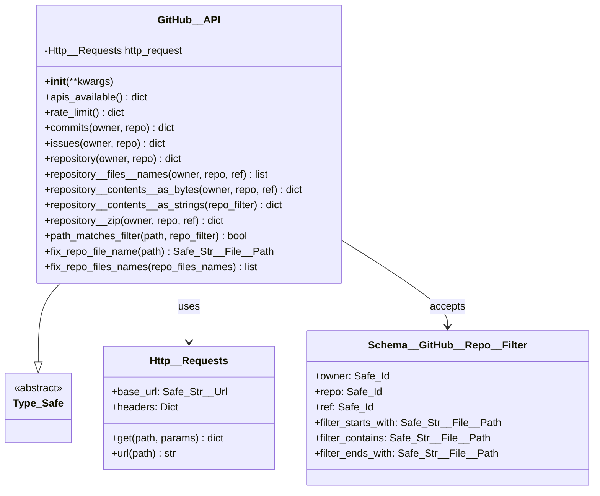
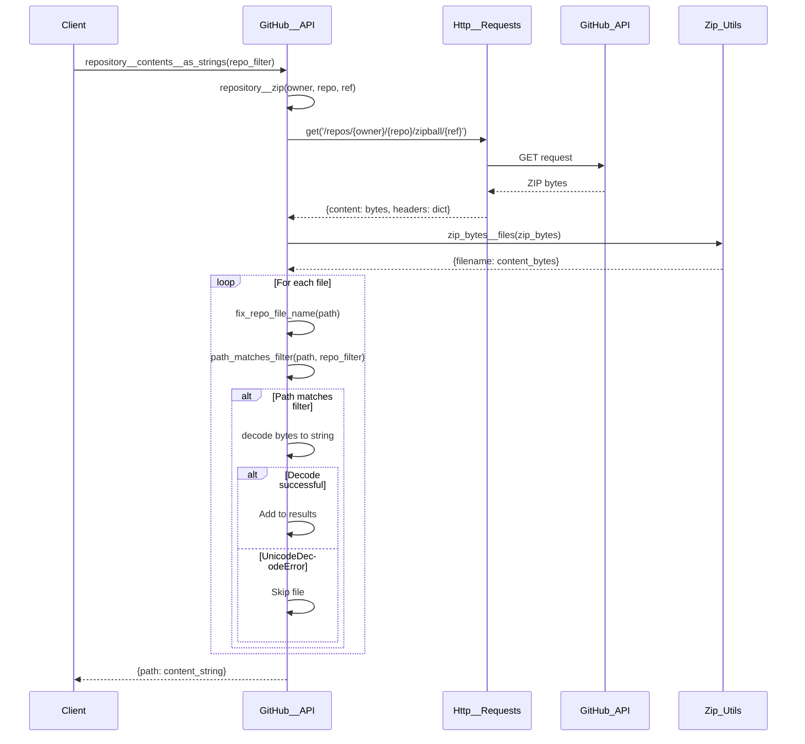
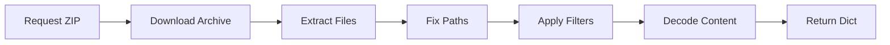

# GitHub__API - Technical Debrief

## Overview

The `GitHub__API` class provides a **type-safe, production-ready interface** to GitHub's REST API v3. It specializes in repository content retrieval, transformation, and filtering with a focus on performance and security.

**Status**: Production Ready  
**Dependencies**: `osbot-utils`, `requests`  
**External API**: GitHub REST API v3

## Architecture



## Data Flow



## Component Breakdown

### 1. Repository Information Methods

```python
def repository(self, owner: Safe_Id, repo: Safe_Id) -> dict:
    """Retrieves repository metadata from GitHub API"""
    path = f'/repos/{owner}/{repo}'
    return self.http_request.get(path)
```

**Returns**: Dictionary containing repository metadata including:
- Basic info: name, description, language, size
- Statistics: stars, forks, watchers, issues
- URLs: clone_url, html_url, various API endpoints
- Metadata: created_at, updated_at, default_branch

### 2. Content Retrieval Pipeline

The content retrieval process follows this pipeline:



#### Key Methods:

**`repository__zip`**: Downloads entire repository as ZIP
- Uses GitHub's zipball endpoint
- Returns raw bytes for processing
- Includes timing metrics

**`repository__contents__as_bytes`**: Extracts files as bytes
- Processes ZIP archive
- Removes repository root folder from paths
- Returns {path: bytes} dictionary

**`repository__contents__as_strings`**: Converts to strings with filtering
- Applies path filters (starts_with, contains, ends_with)
- Handles encoding errors gracefully
- Returns only decodable text files

### 3. Path Processing

```python
def fix_repo_file_name(self, path: str) -> Safe_Str__File__Path:
    """Removes the first path segment (repo root folder)"""
    if '/' not in path:
        return None  # No slashes, can't strip root
    if path.endswith('/'):
        return None  # It's a directory, skip
    fixed_path = path.partition('/')[2]  # Everything after first '/'
    return Safe_Str__File__Path(fixed_path)
```

**Purpose**: GitHub's ZIP includes repo name as root folder, which needs removal for clean paths.

### 4. Filtering System

```python
def path_matches_filter(self, path: Safe_Str__File__Path, 
                       repo_filter: Schema__GitHub__Repo__Filter) -> bool:
    """Apply multiple filter conditions"""
    if repo_filter.filter_starts_with and not path.startswith(repo_filter.filter_starts_with):
        return False
    if repo_filter.filter_ends_with and not path.endswith(repo_filter.filter_ends_with):
        return False
    if repo_filter.filter_contains and repo_filter.filter_contains not in path:
        return False
    return True
```

**Filter Logic**: All conditions must pass (AND logic)

## Performance Metrics

### Time Complexity
- Repository metadata: O(1) - Single API call
- File listing: O(n) - Process all files in ZIP
- Content retrieval: O(n*m) - n files, m average file size

### Space Complexity
- ZIP download: Entire repository in memory
- Processed content: 2x repository size (bytes + strings)

### Optimization Opportunities
1. **Streaming**: Process ZIP without full download
2. **Caching**: Store processed results with TTL
3. **Pagination**: For large repositories
4. **Selective extraction**: Only extract matching files

## Usage Examples

### Basic Repository Information
```python
github_api = GitHub__API()
repo_info = github_api.repository(
    owner=Safe_Id("owasp-sbot"),
    repo=Safe_Id("OSBot-Utils")
)
print(f"Stars: {repo_info['content']['stargazers_count']}")
```

### Filtered File Retrieval
```python
repo_filter = Schema__GitHub__Repo__Filter(
    owner=Safe_Id("owasp-sbot"),
    repo=Safe_Id("OSBot-Utils"),
    ref=Safe_Id("main"),
    filter_starts_with=Safe_Str__File__Path("osbot_utils/helpers"),
    filter_ends_with=Safe_Str__File__Path(".py")
)

python_files = github_api.repository__contents__as_strings(repo_filter)
for path, content in python_files.items():
    print(f"File: {path}, Size: {len(content)} chars")
```

### Rate Limit Checking
```python
rate_info = github_api.rate_limit()
remaining = rate_info['content']['rate']['remaining']
reset_time = rate_info['content']['rate']['reset']
print(f"API calls remaining: {remaining}")
```

## Edge Cases

### 1. Binary Files
- Detected via `UnicodeDecodeError`
- Silently skipped in string conversion
- Available in bytes methods

### 2. Empty Repositories
- Returns empty dictionary
- No errors thrown

### 3. Large Files
- Currently loaded entirely into memory
- May cause memory issues for very large repos

### 4. Rate Limiting
- No automatic retry logic
- Caller must handle 429 responses

### 5. Path Edge Cases
- Files without extensions: Handled normally
- Hidden files (.gitignore): Included
- Nested directories: Preserved in path

## Security Considerations

### Input Validation
- All inputs use `Safe_Id` or `Safe_Str__File__Path`
- Prevents injection attacks
- Type checking at runtime

### API Key Management
- No API keys stored in code
- Uses unauthenticated requests (lower rate limit)
- Production should add GitHub token support

### Content Security
- No execution of downloaded content
- String conversion prevents binary injection
- Path traversal prevented by design

## Best Practices

### 1. Always Check Rate Limits
```python
def safe_api_call(github_api):
    rate = github_api.rate_limit()
    if rate['content']['rate']['remaining'] < 10:
        raise Exception("Rate limit too low")
    return github_api.repository(...)
```

### 2. Use Specific Filters
```python
# Good: Specific filters reduce memory usage
repo_filter.filter_starts_with = "src/"
repo_filter.filter_ends_with = ".py"

# Bad: No filters loads entire repository
repo_filter = Schema__GitHub__Repo__Filter(owner="x", repo="y")
```

### 3. Handle Binary Files
```python
# Get all files including binaries
all_files = github_api.repository__contents__as_bytes(...)

# Get only text files
text_files = github_api.repository__contents__as_strings(...)
```

### 4. Error Handling
```python
try:
    content = github_api.repository__contents__as_strings(filter)
except requests.RequestException as e:
    logger.error(f"GitHub API error: {e}")
    # Implement retry logic or fallback
```