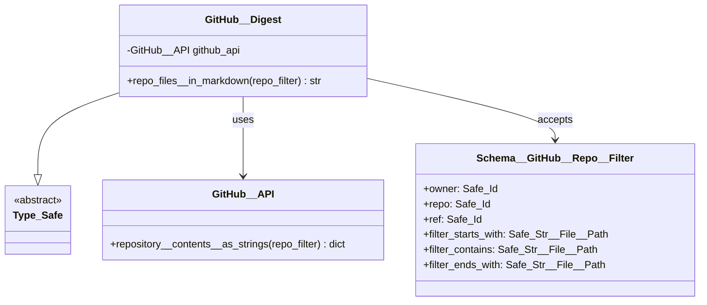
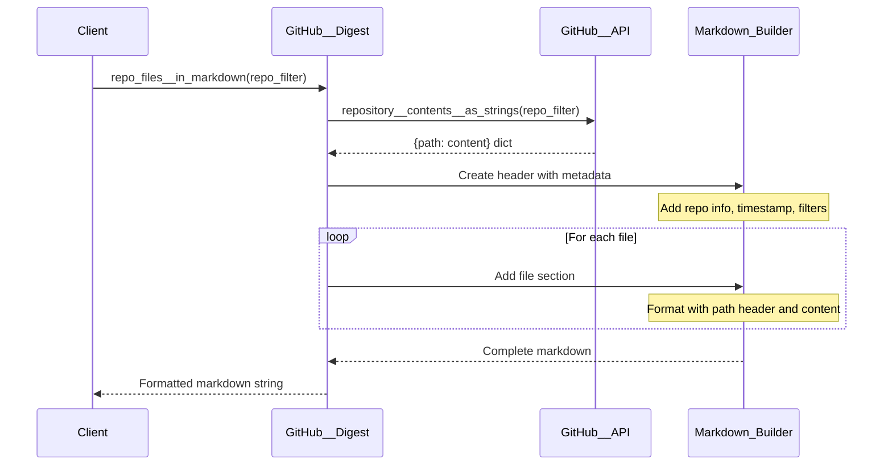

# GitHub__Digest Technical Debrief

## Overview

The `GitHub__Digest` class transforms GitHub repository contents into **structured markdown documents**. It serves as the primary content aggregation layer, converting raw file data into human and machine-readable digests.

**Status**: Production Ready  
**Dependencies**: `GitHub__API`, `osbot-utils`  
**Output Format**: Markdown with metadata

## Architecture



## Data Flow



## Markdown Structure

The generated markdown follows this structure:

```markdown
# Files from Repo
 
 - owner: {owner}
 - repo: {repo} 
 - ref: {ref}

created at: {timestamp}

## Filtered by:
 - starts_with: {filter_starts_with}
 - contains   : {filter_contains}
 - ends_with  : {filter_ends_with}
 
 
## Files:

Showing {count} files that matched the filter(s) 


### {file_path_1}

{file_contents_1}
---

### {file_path_2}

{file_contents_2}
---
```

## Component Breakdown

### Core Method: `repo_files__in_markdown`

```python
def repo_files__in_markdown(self, repo_filter: Schema__GitHub__Repo__Filter):
    files_in_repo = self.github_api.repository__contents__as_strings(repo_filter)
    with repo_filter as _:
        markdown = f"""
# Files from Repo
 
 - owner: {_.owner}
 - repo: {_.repo} 
 - ref: {_.ref}"

created at: { date_time_now()}

## Filtered by:
 - starts_with: {_.filter_starts_with}
 - contains   : {_.filter_contains}
 - ends_with  : {_.filter_ends_with}
 
 
## Files:

Showing {len(files_in_repo)} files that matched the filter(s) 

"""
        for file_path, file_contents in files_in_repo.items():
            markdown__file = f"""
### {file_path}

{file_contents}
---
"""
            markdown += markdown__file
        return markdown
```

### Key Features

1. **Metadata Header**: Includes repository info and creation timestamp
2. **Filter Documentation**: Shows applied filters for reproducibility
3. **File Count**: Displays number of matched files
4. **Structured Sections**: Each file in its own section with separator
5. **Clean Formatting**: Consistent spacing and hierarchy

## Performance Characteristics

### Time Complexity
- O(n) where n is the number of files
- Linear string concatenation
- No nested loops or complex processing

### Memory Usage
- Peak: 3x repository text size
  - Original dict from API
  - Individual file strings
  - Complete markdown string
- Could be optimized with string builders

### Scalability Limits
- String concatenation becomes inefficient for very large outputs
- No streaming support
- Entire output must fit in memory

## Usage Examples

### Basic Repository Digest

```python
digest = GitHub__Digest()
repo_filter = Schema__GitHub__Repo__Filter(
    owner=Safe_Id("owasp-sbot"),
    repo=Safe_Id("OSBot-Utils"),
    ref=Safe_Id("main")
)

markdown = digest.repo_files__in_markdown(repo_filter)
print(markdown[:500])  # First 500 chars
```

### Filtered Python Files

```python
repo_filter = Schema__GitHub__Repo__Filter(
    owner=Safe_Id("my-org"),
    repo=Safe_Id("my-project"),
    ref=Safe_Id("develop"),
    filter_starts_with=Safe_Str__File__Path("src/"),
    filter_ends_with=Safe_Str__File__Path(".py")
)

python_digest = digest.repo_files__in_markdown(repo_filter)
with open("python_files.md", "w") as f:
    f.write(python_digest)
```

### Documentation Generation

```python
# Generate docs for specific module
repo_filter.filter_starts_with = Safe_Str__File__Path("docs/")
repo_filter.filter_ends_with = Safe_Str__File__Path(".md")

docs_digest = digest.repo_files__in_markdown(repo_filter)
```

## Output Format Details

### File Path Headers
- Level 3 markdown headers (`###`)
- Preserves full path from repository root
- No modification of path separators

### Content Formatting
- Raw file content (no syntax highlighting)
- Preserves original formatting and indentation
- No escaping of markdown syntax in content

### Separators
- Triple dash (`---`) between files
- Provides clear visual separation
- Compatible with markdown processors

## Edge Cases

### 1. Empty Repository
```markdown
# Files from Repo
...
## Files:

Showing 0 files that matched the filter(s)
```

### 2. Large Files
- No truncation or summarization
- Full content included
- May result in very large markdown

### 3. Binary Files
- Filtered out by `GitHub__API`
- Not included in digest
- No error indication

### 4. Markdown in Content
- Not escaped
- May interfere with structure
- Could break parsing

### 5. Special Characters
- Unicode preserved
- No encoding issues (already handled by API)
- Line endings normalized

## Integration Points

### FastAPI Route Integration

```python
class Routes__GitHub__Digest(Fast_API_Routes):
    def repo_files_in_markdown(self, ...):
        markdown = self.github_digest.repo_files__in_markdown(repo_filter)
        return PlainTextResponse(markdown, media_type="text/markdown")
```

### File System Export

```python
def export_to_file(digest: GitHub__Digest, filter: Schema__GitHub__Repo__Filter):
    markdown = digest.repo_files__in_markdown(filter)
    filename = f"{filter.owner}_{filter.repo}_{filter.ref}.md"
    with open(filename, "w", encoding="utf-8") as f:
        f.write(markdown)
```

### LLM Processing

```python
def prepare_for_llm(digest: GitHub__Digest, filter: Schema__GitHub__Repo__Filter):
    markdown = digest.repo_files__in_markdown(filter)
    # Truncate if needed for context limits
    max_chars = 100000
    if len(markdown) > max_chars:
        markdown = markdown[:max_chars] + "\n\n... (truncated)"
    return markdown
```

## Best Practices

### 1. Use Specific Filters
```python
# Good: Reduces output size
filter.filter_starts_with = "src/"
filter.filter_ends_with = ".py"

# Bad: May generate huge documents
filter = Schema__GitHub__Repo__Filter(owner="x", repo="large-repo")
```

### 2. Monitor Output Size
```python
markdown = digest.repo_files__in_markdown(filter)
size_mb = len(markdown) / 1024 / 1024
if size_mb > 10:
    logger.warning(f"Large digest: {size_mb:.1f} MB")
```

### 3. Cache Results
```python
cache_key = f"{filter.owner}:{filter.repo}:{filter.ref}"
if cache_key in cache:
    return cache[cache_key]
    
markdown = digest.repo_files__in_markdown(filter)
cache[cache_key] = markdown
```

## Security Considerations

### Content Injection
- No sanitization of file contents
- Markdown syntax in files could break structure
- Consider escaping for untrusted repos

### Information Disclosure
- Includes all file contents
- No access control beyond GitHub's
- Sensitive data may be exposed

### Resource Exhaustion
- Large repos can consume significant memory
- No size limits enforced
- Consider adding max file/size limits

## Testing Strategies

### Unit Tests
```python
def test_empty_repo():
    mock_api = Mock()
    mock_api.repository__contents__as_strings.return_value = {}
    digest = GitHub__Digest(github_api=mock_api)
    result = digest.repo_files__in_markdown(filter)
    assert "Showing 0 files" in result
```

### Integration Tests
```python
def test_real_repo():
    digest = GitHub__Digest()
    filter = Schema__GitHub__Repo__Filter(
        owner=Safe_Id("test-org"),
        repo=Safe_Id("test-repo")
    )
    result = digest.repo_files__in_markdown(filter)
    assert "# Files from Repo" in result
    assert len(result) > 1000
```

### Output Validation
```python
def test_markdown_structure():
    result = digest.repo_files__in_markdown(filter)
    lines = result.split('\n')
    assert lines[0] == "# Files from Repo"
    assert "## Filtered by:" in result
    assert "---" in result  # File separator
```