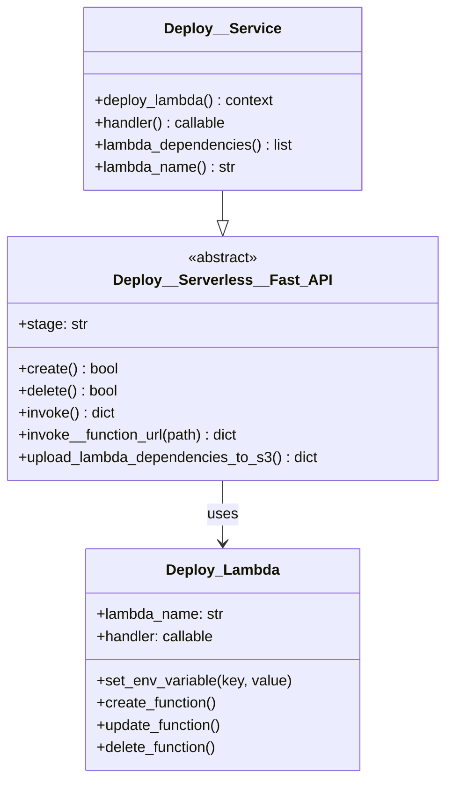
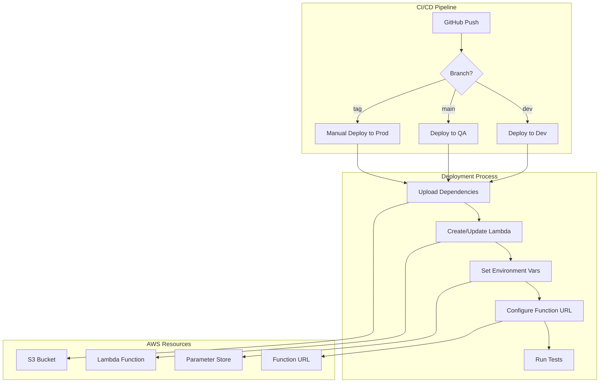
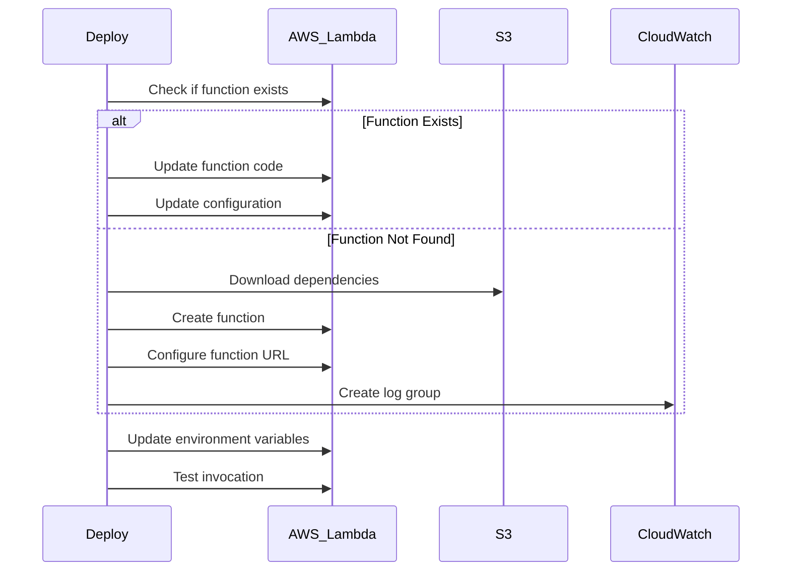
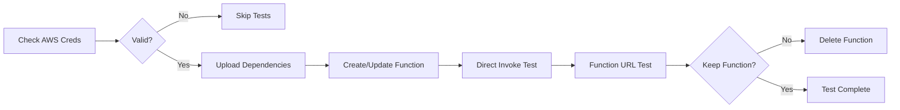

# Deploy__Service Technical Debrief

## Overview

`Deploy__Service` orchestrates the **multi-stage deployment pipeline** for the GitHub Digest service to AWS Lambda. It extends the base serverless deployment with service-specific configurations and environment management.

**Status**: Production Ready  
**Stages**: dev, qa, prod  
**Infrastructure**: AWS Lambda + S3 + CloudWatch

## Architecture



## Deployment Pipeline



## Component Implementation

### Core Deployment Method

```python
def deploy_lambda(self):
    with super().deploy_lambda() as _:
        # Add service-specific environment variables
        ip_data__api_key = get_env(ENV_VAR__IP_DATA__API_KEY)
        if ip_data__api_key:
            _.set_env_variable(ENV_VAR__IP_DATA__API_KEY, ip_data__api_key)
        return _
```

### Configuration Methods

```python
def handler(self):
    """Returns the Lambda handler function"""
    return run  # from lambda_handler module

def lambda_dependencies(self):
    """List of dependencies to package"""
    return LAMBDA_DEPENDENCIES__FAST_API_SERVERLESS

def lambda_name(self):
    """Lambda function name"""
    return SERVICE_NAME  # 'mgraph_ai_service_github_digest'
```

## Environment Configuration

### Stage-Based Settings

```mermaid
graph LR
    subgraph "Development"
        DEV_LAMBDA[service__mgraph-dev]
        DEV_S3[dependencies-dev]
        DEV_LOGS[/aws/lambda/service-dev]
    end
    
    subgraph "QA"
        QA_LAMBDA[service__mgraph-qa]
        QA_S3[dependencies-qa]
        QA_LOGS[/aws/lambda/service-qa]
    end
    
    subgraph "Production"
        PROD_LAMBDA[service__mgraph-prod]
        PROD_S3[dependencies-prod]
        PROD_LOGS[/aws/lambda/service-prod]
    end
```

### Environment Variables

| Variable | Description | Source |
|----------|-------------|---------|
| `FAST_API__AUTH__API_KEY__NAME` | API key header name | GitHub Secrets |
| `FAST_API__AUTH__API_KEY__VALUE` | API key value | GitHub Secrets |
| `IP_DATA__API_KEY` | IPData.co API key | GitHub Secrets |
| `AWS_DEFAULT_REGION` | AWS region | GitHub Secrets |
| `AWS_ACCOUNT_ID` | AWS account ID | GitHub Secrets |

## Deployment Workflow

### 1. Dependency Management

```python
def upload_lambda_dependencies_to_s3(self):
    """Upload packaged dependencies to S3"""
    dependencies = ['osbot-fast-api-serverless==v1.2.0']
    
    results = {}
    for dep in dependencies:
        s3_key = f"lambda-dependencies/{self.stage}/{dep}.zip"
        results[dep] = self.upload_dependency(dep, s3_key)
    
    return results
```

### 2. Lambda Creation/Update



### 3. Function URL Configuration

```python
def configure_function_url(self):
    """Set up Lambda Function URL for HTTP access"""
    lambda_client = boto3.client('lambda')
    
    # Create or update function URL
    try:
        response = lambda_client.create_function_url_config(
            FunctionName=self.lambda_name_with_stage(),
            AuthType='NONE',  # FastAPI handles auth
            Cors={
                'AllowOrigins': ['*'],
                'AllowMethods': ['GET', 'POST', 'PUT', 'DELETE'],
                'AllowHeaders': ['*']
            }
        )
    except lambda_client.exceptions.ResourceConflictException:
        # URL already exists, update CORS
        response = lambda_client.update_function_url_config(...)
    
    return response['FunctionUrl']
```

## Testing Integration

### Deployment Tests

```python
class test_Deploy__Service__to__dev(TestCase):
    @classmethod
    def setUpClass(cls):
        cls.deploy_fast_api__dev = Deploy__Service(stage='dev')
        
        with cls.deploy_fast_api__dev as _:
            if _.aws_config.aws_configured() is False:
                pytest.skip("AWS credentials required")
    
    def test_1__check_stages(self):
        assert self.deploy_fast_api__dev.stage == 'dev'
    
    def test_2__upload_dependencies(self):
        upload_results = self.deploy_fast_api__dev.upload_lambda_dependencies_to_s3()
        assert list_set(upload_results) == LAMBDA_DEPENDENCIES__FAST_API_SERVERLESS
    
    def test_3__create(self):
        assert self.deploy_fast_api__dev.create() is True
    
    def test_4__invoke(self):
        response = self.deploy_fast_api__dev.invoke()
        assert response.get('errorMessage') == DEFAULT__ERROR_MESSAGE__WHEN_FAST_API_IS_OK
    
    def test_5__invoke__function_url(self):
        version = {'version': version__mgraph_ai_service_github_digest}
        assert self.deploy_fast_api__dev.invoke__function_url('/info/version') == version
```

### Test Execution Flow



## CI/CD Integration

### GitHub Actions Workflow

```yaml
name: CI Pipeline - DEV
on:
  push:
    branches: [dev]

env:
  GIT__BRANCH: 'dev'
  RELEASE_TYPE: 'minor'
  PACKAGE_NAME: 'mgraph_ai_service_github_digest'
  TARGET_DEPLOY: 'dev'

jobs:
  run-tests:
    runs-on: ubuntu-latest
    steps:
      - uses: actions/checkout@v4
      
      - name: Start LocalStack
        uses: owasp-sbot/OSBot-GitHub-Actions/.github/actions/docker__local-stack@dev
        with:
          LOCAL_STACK_SERVICES: 's3,lambda,iam,logs'
      
      - name: Run tests
        uses: owasp-sbot/OSBot-GitHub-Actions/.github/actions/pytest__run-tests@dev
        with:
          test_target: "tests/unit"
        env:
          FAST_API__AUTH__API_KEY__NAME: 'test-key'
          FAST_API__AUTH__API_KEY__VALUE: 'test-value'
  
  deploy:
    needs: run-tests
    runs-on: ubuntu-latest
    steps:
      - uses: actions/checkout@v4
      
      - name: Deploy Lambda
        uses: ./.github/actions/aws__deploy__lambda
        env:
          AWS_SECRET_ACCESS_KEY: ${{ secrets.AWS_SECRET_ACCESS_KEY }}
          AWS_DEFAULT_REGION: ${{ secrets.AWS_DEFAULT_REGION }}
          AWS_ACCOUNT_ID: ${{ secrets.AWS_ACCOUNT_ID }}
          AWS_ACCESS_KEY_ID: ${{ secrets.AWS_ACCESS_KEY_ID }}
          FAST_API__AUTH__API_KEY__NAME: ${{ secrets.FAST_API__AUTH__API_KEY__NAME }}
          FAST_API__AUTH__API_KEY__VALUE: ${{ secrets.FAST_API__AUTH__API_KEY__VALUE }}
          IP_DATA__API_KEY: ${{ secrets.IP_DATA__API_KEY }}
        with:
          target: ${{ env.TARGET_DEPLOY }}
```

### Deployment Action

```yaml
name: "aws__deploy__lambda"
inputs:
  environment:
    description: "Target deployment (dev, qa or main)"
    required: true

runs:
  using: "composite"
  steps:
    - name: Set up Python
      uses: actions/setup-python@v4
      with:
        python-version: 3.12
    
    - name: Install dependencies
      shell: bash
      run: |
        pip install -r requirements-test.txt
        pip install -e .
    
    - name: Deploy to Lambda
      shell: bash
      run: |
        pytest -rs ./tests/deploy_aws/test_Deploy__Service__to__${{ inputs.target }}.py
```

## Monitoring and Rollback

### CloudWatch Alarms

```python
def create_cloudwatch_alarms(self):
    """Set up monitoring alarms for the Lambda function"""
    cloudwatch = boto3.client('cloudwatch')
    
    alarms = [
        {
            'AlarmName': f'{self.lambda_name_with_stage()}-errors',
            'MetricName': 'Errors',
            'Statistic': 'Sum',
            'Period': 300,
            'EvaluationPeriods': 1,
            'Threshold': 10
        },
        {
            'AlarmName': f'{self.lambda_name_with_stage()}-duration',
            'MetricName': 'Duration',
            'Statistic': 'Average',
            'Period': 300,
            'EvaluationPeriods': 2,
            'Threshold': 5000  # 5 seconds
        }
    ]
    
    for alarm in alarms:
        cloudwatch.put_metric_alarm(**alarm)
```

### Rollback Strategy

```python
def rollback_deployment(self, version_to_restore):
    """Rollback to a previous Lambda version"""
    lambda_client = boto3.client('lambda')
    
    # Create alias pointing to previous version
    lambda_client.update_alias(
        FunctionName=self.lambda_name_with_stage(),
        Name='LIVE',
        FunctionVersion=version_to_restore
    )
    
    # Update function URL to point to alias
    self.update_function_url_to_alias('LIVE')
```

## Security Considerations

### IAM Role Configuration

```json
{
  "Version": "2012-10-17",
  "Statement": [
    {
      "Effect": "Allow",
      "Action": [
        "logs:CreateLogGroup",
        "logs:CreateLogStream",
        "logs:PutLogEvents"
      ],
      "Resource": "arn:aws:logs:*:*:*"
    },
    {
      "Effect": "Allow",
      "Action": [
        "s3:GetObject"
      ],
      "Resource": "arn:aws:s3:::lambda-dependencies/*"
    },
    {
      "Effect": "Allow",
      "Action": [
        "ssm:GetParameter"
      ],
      "Resource": "arn:aws:ssm:*:*:parameter/api-keys/*"
    }
  ]
}
```

### Secret Management

```python
def get_secret_from_ssm(self, parameter_name):
    """Retrieve sensitive values from Parameter Store"""
    ssm = boto3.client('ssm')
    
    response = ssm.get_parameter(
        Name=parameter_name,
        WithDecryption=True
    )
    
    return response['Parameter']['Value']

def set_secure_env_variables(self):
    """Set environment variables from secure storage"""
    secure_vars = {
        'FAST_API__AUTH__API_KEY__VALUE': '/api-keys/github-digest',
        'IP_DATA__API_KEY': '/api-keys/ipdata'
    }
    
    for env_var, param_name in secure_vars.items():
        value = self.get_secret_from_ssm(param_name)
        self.lambda_config.set_env_variable(env_var, value)
```

## Best Practices

### 1. Stage Isolation

```python
def ensure_stage_isolation(self):
    """Prevent cross-stage contamination"""
    # Unique names per stage
    self.lambda_name = f"{SERVICE_NAME}-{self.stage}"
    self.s3_prefix = f"deployments/{self.stage}/"
    self.log_group = f"/aws/lambda/{self.lambda_name}"
```

### 2. Deployment Validation

```python
def validate_deployment(self):
    """Run smoke tests after deployment"""
    tests = [
        ('/info/version', 200),
        ('/github-api/rate-limit', 200),
        ('/invalid-path', 404)
    ]
    
    for path, expected_status in tests:
        response = self.invoke__function_url(path)
        assert response.status_code == expected_status
```

### 3. Gradual Rollout

```python
def canary_deployment(self, traffic_percentage=10):
    """Route percentage of traffic to new version"""
    lambda_client = boto3.client('lambda')
    
    # Create weighted alias
    lambda_client.create_alias(
        FunctionName=self.lambda_name_with_stage(),
        Name='canary',
        FunctionVersion='$LATEST',
        RoutingConfig={
            'AdditionalVersionWeights': {
                str(self.previous_version): 1.0 - (traffic_percentage / 100)
            }
        }
    )
```

## Troubleshooting

### Common Issues

1. **Dependency Conflicts**
   - Check pip freeze output
   - Verify compatible versions
   - Use pip-tools for resolution

2. **Lambda Size Limits**
   - Move large deps to layers
   - Remove unnecessary files
   - Use S3 for static assets

3. **Cold Start Performance**
   - Enable provisioned concurrency
   - Optimize import statements
   - Reduce dependency count