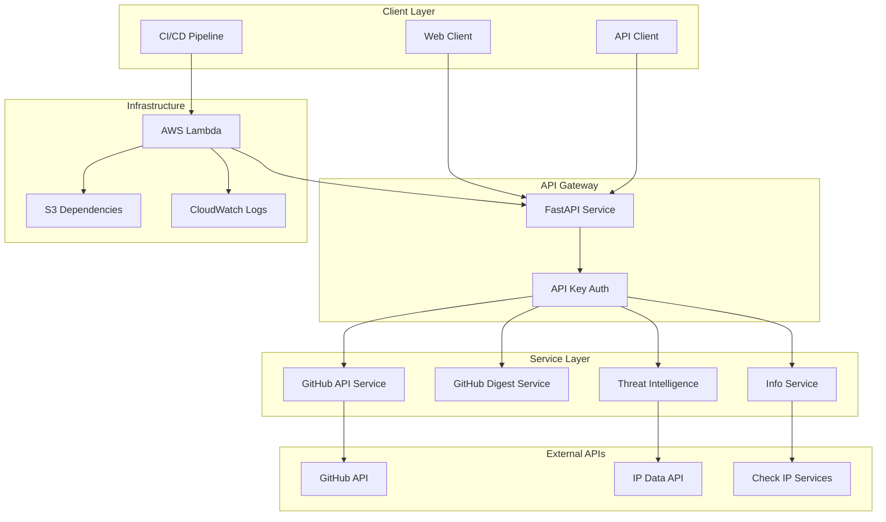

# MGraph-AI Service GitHub Digest Documentation

## 🎯 Overview

MGraph-AI Service GitHub Digest is a **production-ready FastAPI microservice** that provides GitHub repository analysis, content digestion, and threat intelligence capabilities. Built for AWS Lambda deployment with a focus on type safety and security.

## 🏗️ System Architecture



## 📦 Component Overview

### Core Services

- **[GitHub API Service](code/mgraph_ai_service_github_digest/service/github/GitHub__API--tech_debrief.md)** - Direct GitHub API integration with repository analysis
- **[GitHub Digest Service](code/mgraph_ai_service_github_digest/service/github/GitHub__Digest--tech_debrief.md)** - Content aggregation and markdown generation
- **[Threat Intelligence Service](code/mgraph_ai_service_github_digest/service/threat_intelligence/IP_Data--tech_debrief.md)** - IP address analysis and threat detection
- **[Info Service](code/mgraph_ai_service_github_digest/service/info/Info__Current_IP_Address--tech_debrief.md)** - System information and IP discovery

### FastAPI Routes

- **[GitHub API Routes](code/mgraph_ai_service_github_digest/fast_api/routes/Routes__GitHub__API--tech_debrief.md)** - RESTful endpoints for GitHub operations
- **[GitHub Digest Routes](code/mgraph_ai_service_github_digest/fast_api/routes/Routes__GitHub__Digest--tech_debrief.md)** - Markdown digest generation endpoints
- **[Info Routes](code/mgraph_ai_service_github_digest/fast_api/routes/Routes__Info--tech_debrief.md)** - System information endpoints
- **[Threat Intelligence Routes](code/mgraph_ai_service_github_digest/fast_api/routes/Routes__Threat_Intelligence--tech_debrief.md)** - IP analysis endpoints

### Infrastructure

- **[Lambda Handler](code/mgraph_ai_service_github_digest/fast_api/lambda_handler--tech_debrief.md)** - AWS Lambda integration
- **[Deploy Service](code/mgraph_ai_service_github_digest/utils/deploy/Deploy__Service--tech_debrief.md)** - Multi-stage deployment orchestration
- **[Service Configuration](code/mgraph_ai_service_github_digest/config--tech_debrief.md)** - Environment and service configuration

## 🚀 Quick Start

### Local Development

```bash
# Install dependencies
pip install -r requirements-test.txt

# Run locally
uvicorn mgraph_ai_service_github_digest.fast_api.lambda_handler:app --reload --host 0.0.0.0 --port 10010
```

### API Authentication

Set environment variables:
```bash
export FAST_API__AUTH__API_KEY__NAME="your-api-key-name"
export FAST_API__AUTH__API_KEY__VALUE="your-api-key-value"
```

### Basic Usage

```python
import requests

headers = {"your-api-key-name": "your-api-key-value"}

# Get repository information
response = requests.get(
    "http://localhost:10010/github-api/repository",
    params={"owner": "owasp-sbot", "repo": "OSBot-Utils"},
    headers=headers
)

# Generate markdown digest
response = requests.get(
    "http://localhost:10010/github-digest/repo-files-in-markdown",
    params={
        "owner": "owasp-sbot",
        "repo": "OSBot-Utils",
        "filter_starts_with": "osbot_utils",
        "filter_ends_with": ".py"
    },
    headers=headers
)
```

## 🔐 Security Features

- **API Key Authentication**: All endpoints require valid API key
- **Input Validation**: Type-safe inputs using `Safe_Id` and custom validators
- **IP Address Validation**: Custom `Safe_Str__IP_Address` with injection protection
- **Rate Limiting**: Respects GitHub API rate limits
- **AWS IAM**: Lambda execution with least privilege

## 📊 Performance Characteristics

- **Cold Start**: ~2-3s (Lambda with dependencies)
- **Warm Response**: <100ms for cached responses
- **Memory Usage**: 256MB-512MB depending on repository size
- **Concurrent Requests**: Limited by Lambda concurrency settings

## 🧪 Testing Strategy

- **Unit Tests**: Comprehensive coverage for all services
- **Integration Tests**: LocalStack for AWS services
- **Deployment Tests**: Multi-stage validation (dev/qa/prod)
- **Security Tests**: Input validation and injection prevention

## 📚 Key Design Patterns

### Type Safety
All services extend `Type_Safe` base class for runtime type checking and validation.

### Dependency Injection
Services are injected into routes, enabling easy testing and modularity.

### Schema-First Design
Request/response schemas defined using Pydantic models.

### Multi-Stage Deployment
Separate configurations for dev, qa, and production environments.

## 🛠️ Development Workflow

```mermaid
graph LR
    DEV[Local Development] --> TEST[Run Tests]
    TEST --> COMMIT[Commit to Dev]
    COMMIT --> CI[GitHub Actions]
    CI --> DEPLOY_DEV[Deploy to Dev]
    DEPLOY_DEV --> TEST_DEV[Test Dev Environment]
    TEST_DEV --> MERGE[Merge to Main]
    MERGE --> DEPLOY_QA[Deploy to QA]
    DEPLOY_QA --> TEST_QA[Test QA]
    TEST_QA --> DEPLOY_PROD[Deploy to Prod]
```



## 📖 Documentation Structure

- **[Type Safety Framework](type_safe/)** - Type-safe patterns and utilities
- **[Code Documentation](code/)** - File-by-file technical documentation
- **[API Reference](api/)** - OpenAPI specification and examples
- **[Deployment Guide](deployment/)** - AWS Lambda deployment procedures

## 🔗 Related Projects

- [OSBot-Utils](https://github.com/owasp-sbot/OSBot-Utils) - Core utilities library
- [OSBot-AWS](https://github.com/owasp-sbot/OSBot-AWS) - AWS integration layer
- [OSBot-Fast-API](https://github.com/owasp-sbot/OSBot-Fast-API) - FastAPI utilities